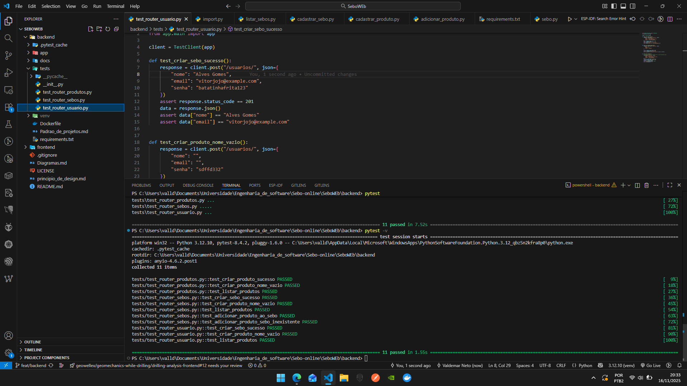

# Testes Realizados

# 🧪 Testes da Aplicação — Sebo Online

Este documento descreve os testes implementados no MVP da aplicação Sebo Online, cobrindo as funcionalidades de Sebos, Produtos e Usuários.
Os testes foram desenvolvidos utilizando pytest, garantindo isolamento entre as camadas de aplicação e infraestrutura.


# ✔️ Estrutura de Testes
```
tests/
│── test_sebo.py
│── test_produto.py
└── test_usuario.py
```


## Testes para Sebo

### 🔍 Objetivos dos teste

- Verificar o cadastro correto de um sebo.

- Garantir que nomes duplicados não sejam permitidos.

- Validar o retorno de todos os sebos cadastrados.

- Garantir que o sebo retorna com lista de produtos vazia inicialmente.

#### 🧪 Casos de Teste Implementados

1. Deve cadastrar um novo sebo

    - Envia um payload com nome, descrição e dono_id.

    - Verifica se o objeto retornado contém id, nome, descricao, dono_id e produtos=[].

2. Não deve permitir cadastro de sebos com nomes repetidos

    - Cria um sebo.

    - Tenta criar outro com o mesmo nome.

    - Espera erro do tipo ValueError.

3. Deve listar todos os sebos

    - Cadastra dois sebos.

    - Usa o caso de uso ListarSeboUseCase.

    - Estado esperado: retorno de lista com dois sebos.

## 📦 Testes do Módulo Produto (test_produto.py)
### 🔍 Objetivos

- Testar a adição de produtos ao sebo.

- Garantir a persistência correta no banco.

- Validar o retorno do produto com ID gerado.

- Verificar erro se o sebo não existir.

#### 🧪 Casos de Teste
1. Deve adicionar um produto a um sebo existente

    Passos:

    - Criar sebo de teste.

    - Enviar payload de produto: nome, descrição, preço.

     - Verificar se o produto retornado tem:

       - id

        - nome

       - preco

       -  sebo_id correto

2. Deve retornar erro ao adicionar produto a um sebo inexistente

   -  Chama use_case.execute(sebo_id_inexistente, produto)

    - Verifica que lança ValueError("Sebo não encontrado")

3. Produto deve aparecer vinculado ao sebo quando ele for listado

   - Cria sebo

   - Adiciona produto
   - Chama ListarSeboUseCase

   - Verifica que o sebo tem produtos com 1 item


### 👤 Testes do Módulo Usuário (test_usuario.py)
#### 🔍 Objetivos

   - Validar criação de usuário
   - Garantir que o e-mail é único
   - Testar autenticação

#### 🧪 Casos de Teste
1. Deve criar usuário

    - Envia payload com nome, email e senha.

    - Verifica retorno com id e email.

2. Não deve permitir emails duplicados

    - Cria usuário.

    - Tenta criar outro com o mesmo email.

    - Espera erro de validação.

3. Deve autenticar usuário (caso o módulo esteja implementado)

   -  Cadastra usuário.

   - Realiza login com email/senha.

    - Retorna token ou objeto autenticado.


### Imagem do teste feito com a cobertura de no mínimo 60 %


